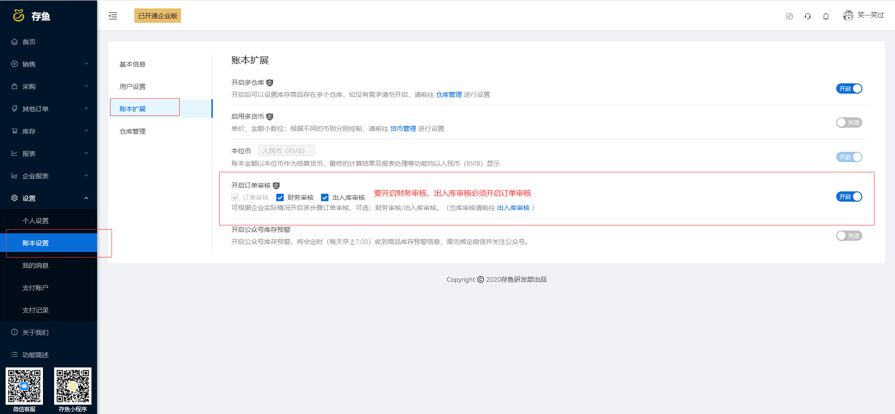
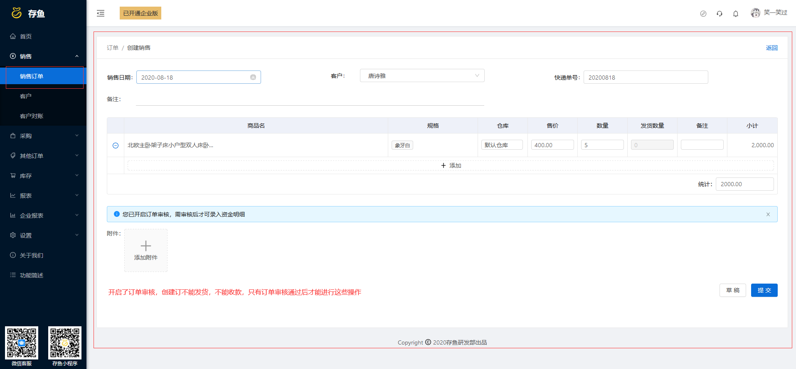
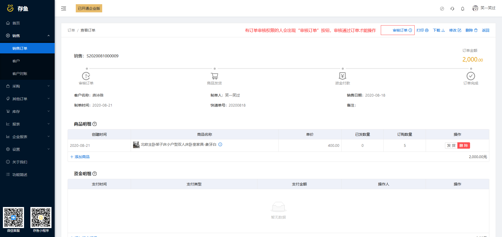
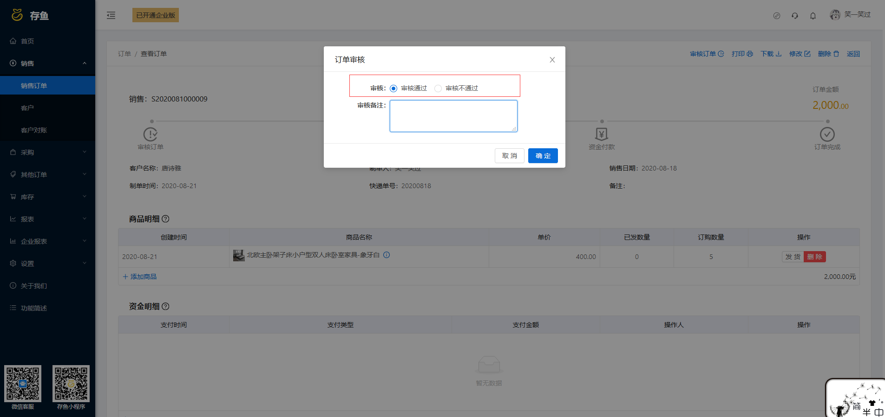
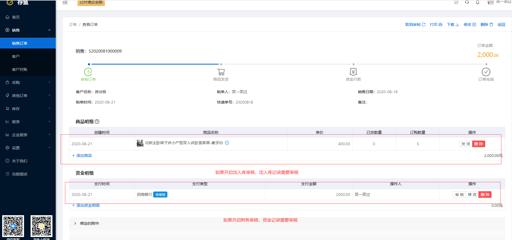
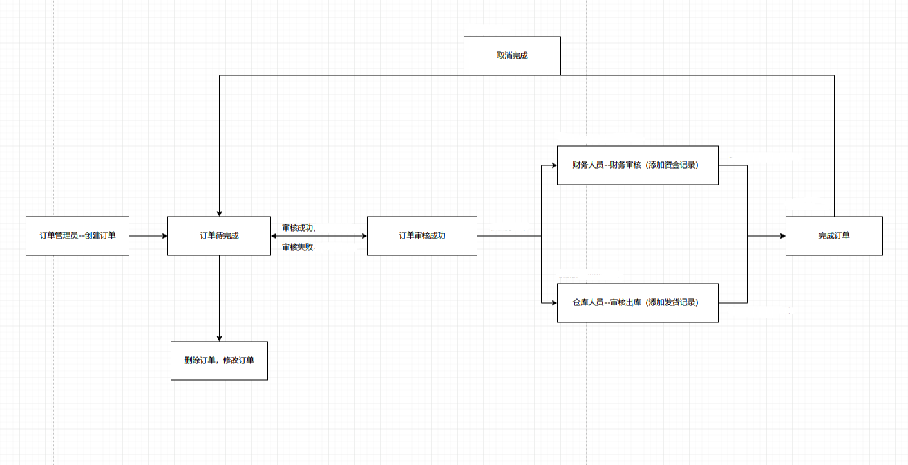

# 订单审核（<u>企业版</u>）

入口：设置---账本设置---用户设置---订单审核

#### 一、功能说明

订单审核，当用户开启订单审核时，录入订单需要经过订单审核人员审核（订单审核权限，在权限可以设置）通过才能完成。

录入订单时，不能录入资金，发货记录，只有审核通过后才能录入

订单审核，只有订单审核权限的人才能审核

如果开启“ 财务审核 ”，资金需要财务审核（有财务审核权限的人，在权限可以设置）才能完成

如果开启“ 出入库审核 ”，出入库需要出入库审核（有出入库审核权限的人，在权限可以设置）才能完成

#### 流程

