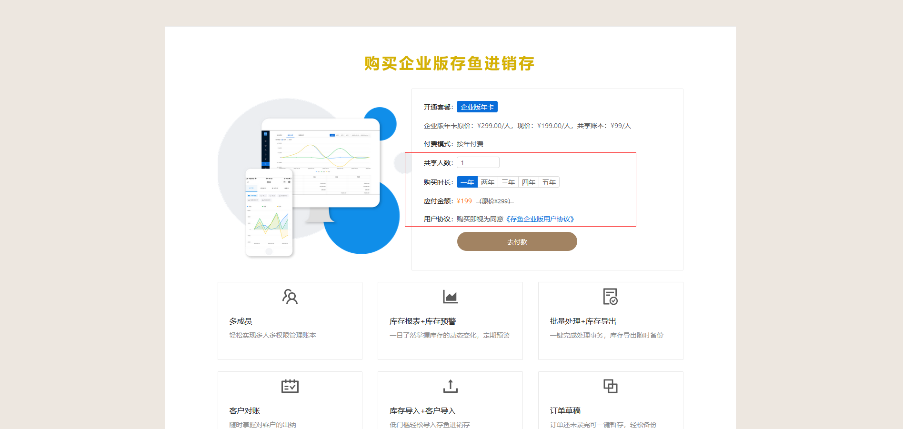

# 如何购买企业版？
## 小程序如何购买企业版

#### 1.首页，点击「存鱼企业版」横幅

#### 2.进入企业版介绍页，点击「立即开通企业版」

#### 3.进入企业版付费页，选择「人数」、「年数」，点击「确认支付」即可

## 电脑端如何购买企业版

#### 1.进入购买界面

登录存鱼进销存系统，在首页可以点击购买。

#### 2.了解企业版

进入购买页面，这里可以了解存鱼企业版和免费版的区别

#### 3.购买企业版

