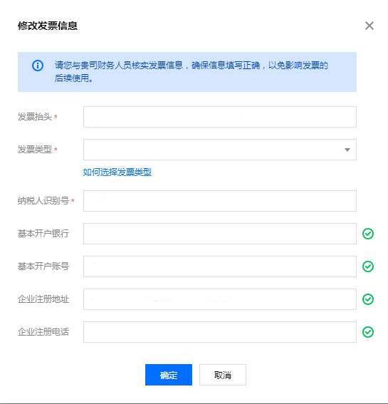

# 小程序如何购买企业版

#### 1.首页，点击「存鱼企业版」横幅

#### 2.进入企业版介绍页，点击「立即开通企业版」

#### 3.进入企业版付费页，选择「人数」、「年数」，点击「确认支付」即可

#### 4.企业版购买规则

第一个用户为管理员，账本的拥有者为 <u>**¥199.00**</u> （原价299）

之后的每个用户为 共享账本：<u>**¥99/人**</u>（原价199）

#### 5.申请发票

如果用户需要开发票，可以向客服申请，只要提供发票抬头，发票类型，纳税人识别码即可

